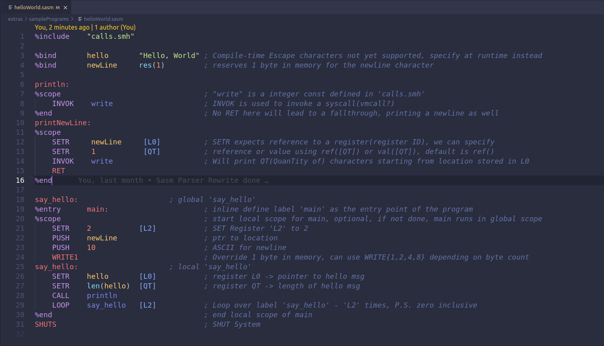

# VIREX : Virtual Execution Console

[](LICENSE) [](https://github.com/Soham-Metha/virex/actions) [](https://virex.readthedocs.io/en/latest/) [](CONTRIBUTING.md)

---

**VIREX** (**VIR**tual **EX**ecuter) is a platform-independent virtual machine designed around a flexible intermediate language called **SASM** (Simulated Assembly). It’s inspired by the **Java Virtual Machine (JVM)**, but unlike JVM bytecode, SASM is **open, readable, and writable** — you can program directly in it. VIREX allows you to explore VM internals, build compilers, and experiment with language design; all in C.

---

## 🚀 What is SASM?

Just like Java compiles to bytecode for the JVM, any language can be compiled into SASM for VIREX. The difference is:

- SASM is **assembly-like**, human-readable, and editable.
- SASM is **open**, letting anyone build tools and languages around it.

You can even create your own programming language that compiles into SASM and runs anywhere VIREX runs — making your language instantly portable.

This makes SASM ideal for systems programmers, compiler devs, and those learning how VMs work.

---

## 🧠 Why SASM?

- Understand **low-level systems** through a safe, abstracted virtual environment.
- Learn how **assembly-level code** works through a clean and simplified syntax.
- Build a **compiler** without worrying about machine-level code generation.
- Make your own language **platform-independent** by targeting SASM.

---

## 🛠 Current Features

- ✅ **VS Code syntax highlighter** for SASM
- 🌲 **AST visualizer** for seeing how your SASM code is parsed and compiled
- 🔧 A new programming language called **ORIN** is currently under development. It is being designed to compile directly to SASM.

> If you're interested in compilers, interpreters, language design, VMs, or systems programming, **we’d love your contributions**!

---

## 📦 Project Layout

```
/docs/            # Documentation & diagrams
/examples/        # Sample programs in SASM
/include/         # Public headers
/src/             # Core code (VM, assembler, compiler)
/tests/           # Test cases for SASM programs
/tools/themes/    # VS Code syntax highlighter and dev tools
/install.sh       # One-command installer
```

---

## 🧪 Getting Started (Linux)

> 📝 For more detailed setup and usage guides, visit [our docs »](https://virex.readthedocs.io/en/latest/)

### 1. Clone and install:

```bash
git clone https://github.com/Soham-Metha/virex.git
cd virex/
./install.sh
```

### 2. Run a demo:

```bash
cd examples/SASM/
virex
```

> If the **UI looks misaligned**, try adjusting your **terminal font size** or tweak layout values in `src/VM/vm_tui.c::CreateWindows()`.

---

## 🎨 Developer Tools

### Syntax Highlighting in VS Code

- Install from `/tools/themes/vs_code`
- Then:
  1. Open any `.sasm` file
  2. Press `Ctrl + Shift + P` → `Preferences: Color Theme` → Select `Palenight+sasm`

---

## 💡 Contributing

We’re actively working on:

- 🚧 The **ORIN** programming language (compiler -> SASM)
- 🧩 Tooling for SASM (debuggers, profilers, IDE integrations)
- 📖 Better documentation and tutorials

Want to get involved? See our [CONTRIBUTING.md](CONTRIBUTING.md) (coming soon).

---

## 🧪 Examples

### Syntax Highlighting



### AST Visualization


> Each block represents a scope. Block 0 = global scope.

### Terminal UI


## ⚙️ Tech Stack

- **Language**: C
- **Build System**: GNU Make
- **Visualization**: Graphviz
- **Version Control**: Git

---

## 📚 More Info

<!--  -->

Full documentation (including internal architecture and instruction sets) is available at:  
📖 [https://virex.readthedocs.io](https://virex.readthedocs.io/en/latest/)

---

## 📬 License

This project is licensed under the **GNU General Public License v3.0**.  
You may copy, distribute, and modify the software as long as changes remain open-source and licensed under GPL-3.0.

📄 See the full [LICENSE](LICENSE) file for details.

---
