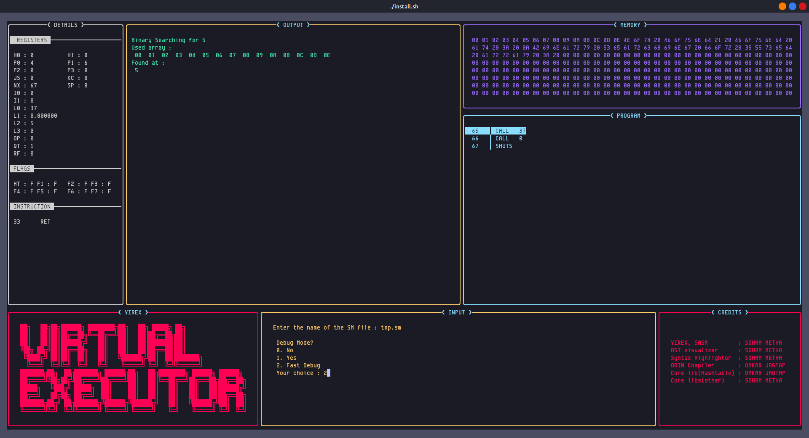

# VIREX : Virtual Execution Console


[](https://github.com/Soham-Metha)

<table align="center">
    <thead align="center">
        <tr border: 1px;>
            <td><b> Stars</b></td>
            <td><b>🍴 Forks</b></td>
            <td><b> Issues</b></td>
            <td><b> Open PRs</b></td>
            <td><b> Closed PRs</b></td>
        </tr>
     </thead>
    <tbody>
         <tr>
            <td></td>
             <td></td>
            <td></td>
            <td></td>
           <td></td>
        </tr>
    </tbody>
</table>

[](LICENSE) [](https://github.com/Soham-Metha/virex/actions) [](https://virex.readthedocs.io/en/latest/) [](CONTRIBUTING.md)

---

**VIREX** (**VIR**tual **EX**ecuter) is a platform-independent virtual machine designed around a flexible intermediate language called **SASM** (Simulated Assembly). It’s inspired by the **Java Virtual Machine (JVM)**, but unlike JVM bytecode, SASM is **open, readable, and writable** — you can program directly in it. VIREX allows you to explore VM internals, build compilers, and experiment with language design; all in C.

---

## 🚀 What is SASM?

Just like Java compiles to bytecode for the JVM, any language can be compiled into SASM for VIREX. The difference is:

- SASM is **assembly-like**, human-readable, and editable.
- SASM is **open**, letting anyone build tools and languages around it.

You can even create your own programming language that compiles into SASM and runs anywhere VIREX runs — making your language instantly portable.

This makes SASM ideal for systems programmers, compiler devs, and those learning how VMs work.

---
## 🧠 Why SASM?

- Understand **low-level systems** through a safe, abstracted virtual environment.
- Learn how **assembly-level code** works through a clean and simplified syntax.
- Build a **compiler** without worrying about machine-level code generation.
- Make your own language **platform-independent** by targeting SASM.

---
## 🛠 Current Features

- ✅ **VS Code syntax highlighter** for SASM
- 🌲 **AST visualizer** for seeing how your SASM code is parsed and compiled
- 🔧 A new programming language called **ORIN** is currently under development. It is being designed to compile directly to SASM.

> If you're interested in compilers, interpreters, language design, VMs, or systems programming, **we’d love your contributions**!

---
## 📦 Project Layout

```
/docs/            # Documentation & diagrams
/examples/        # Sample programs in SASM
/include/         # Public headers
/src/             # Core code (VM, assembler, compiler)
/tests/           # Test cases for SASM programs
/tools/themes/    # VS Code syntax highlighter and dev tools
/install.sh       # One-command installer
```

---
## 🧪 Getting Started (Linux)

> 📝 For more detailed setup and usage guides, visit [our docs »](https://virex.readthedocs.io/en/latest/)

### 1. Clone and install:

```bash
git clone https://github.com/Soham-Metha/virex.git
cd virex/
./install.sh
```

### 2. Run a demo:

```bash
cd examples/SASM/
virex
```

> If the **UI looks misaligned**, try adjusting your **terminal font size** or tweak layout values in `src/VM/vm_tui.c::CreateWindows()`.

---

## 🎨 Developer Tools

### Syntax Highlighting in VS Code

- Install from `/tools/themes/vs_code`
- Then:
  1. Open any `.sasm` file
  2. Press `Ctrl + Shift + P` → `Preferences: Color Theme` → Select `Palenight+sasm`

---

## 💡 Contributing

We’re actively working on:

- 🚧 The **ORIN** programming language (compiler -> SASM)
- 🧩 Tooling for SASM (debuggers, profilers, IDE integrations)
- 📖 Better documentation and tutorials

Want to get involved? See our [CONTRIBUTING.md](CONTRIBUTING.md) (coming soon).

---

## 🧪 Examples

### Syntax Highlighting


### AST Visualization


> Each block represents a scope. Block 0 = global scope.

### Terminal UI



## ⚙️ Tech Stack

- **Language**: C
- **Build System**: GNU Make
- **Visualization**: Graphviz
- **Version Control**: Git

---

## 📚 More Info

<!--  -->

Full documentation (including internal architecture and instruction sets) is available at:  
📖 [https://virex.readthedocs.io](https://virex.readthedocs.io/en/latest/)

---

## 📬 License

This project is licensed under the **GNU General Public License v3.0**.  
You may copy, distribute, and modify the software as long as changes remain open-source and licensed under GPL-3.0.

📄 See the full [LICENSE](LICENSE) file for details.

---
## 💡 Suggestions & Feedback
Feel free to open issues or discussions if you have any feedback, feature suggestions, or want to collaborate!

---
## 📬 Contact

Have ideas, feedback, or just want to say hi?
- 🛠️ Open an issue in the repository

---
## 📜 Code of Conduct

To ensure a welcoming and inclusive environment, we have a Code of Conduct that all contributors are expected to follow. In short: **Be respectful, be kind, and be collaborative.** Please read the full [Code of Conduct](https://github.com/Soham-Metha/virex/blob/main/CODE_OF_CONDUCT.md) before participating.

---
<h2>Project Admin:</h2>
<table>
<tr>
<td align="center">
<a href="https://github.com/Soham-Metha"></a><br><sub><b>Soham-Metha</b><br><a href="https://www.linkedin.com/in/soham-metha-6692752b3/"></a></sub>
</td>
</tr>
</table>

---
<div align="center">
  <h2 style="font-size:3rem;">Our Contributors </h2>
  </div>
  <h3>Thanks to these amazing people who have contributed to the **virex** project:</h3>
<p align="center">
    
</p>
<p style="font-family:var(--ff-philosopher);font-size:3rem;"><b> Show some  by starring this awesome repository!
</p>

---
***🚀 Virex: Enabling Clean-Room Virtual Machines—One SASM Instruction at a Time! 🧬✨***

---
 **👨‍💻 Developed By**  **❤️Soham-Metha❤️**
[GitHub](https://github.com/Soham-Metha/) | [LinkedIn](https://www.linkedin.com/in/soham-metha-6692752b3/)

[🔝 Back to Top](#top)