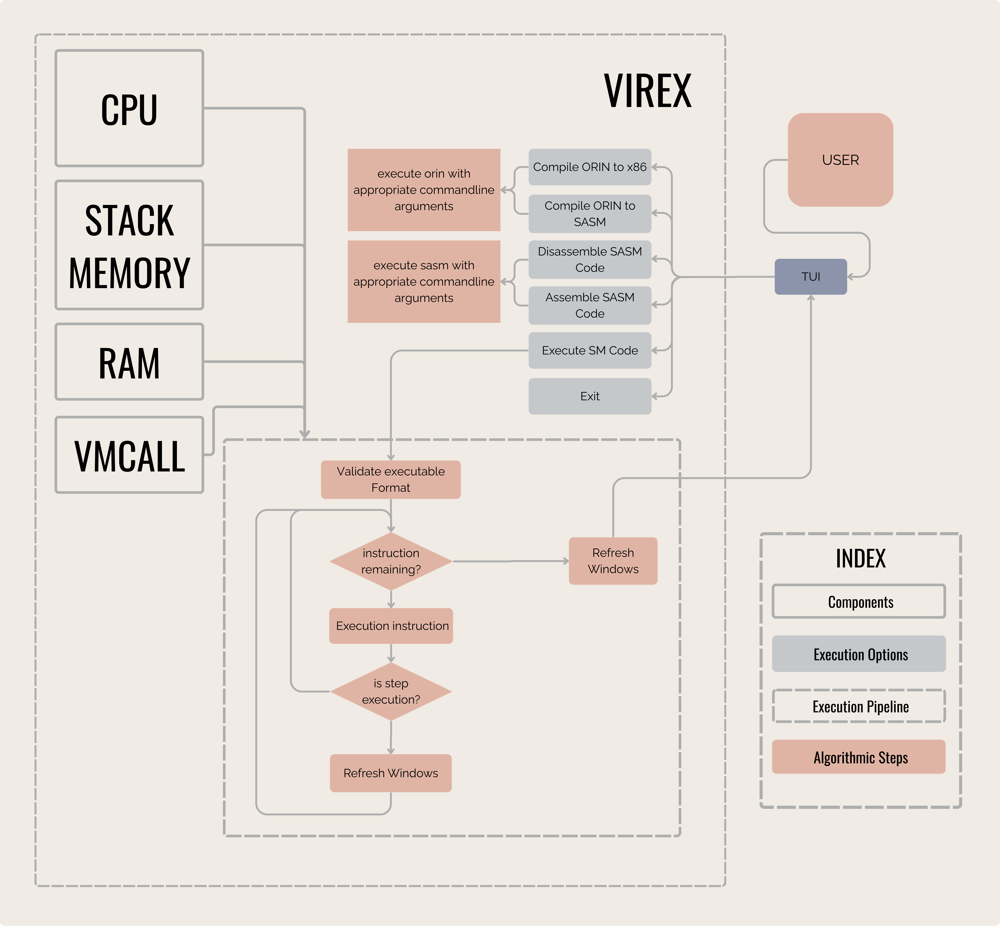

---
hide:
  - toc
---

!!! info inline end ""

    !!! danger ""

        **Programming Language:** C
        **Version Control:** Git
        **Build System:** GNU Make
        **AST VISUALIZER:** Graphviz

    Tech Stack
    !!! warning ""

    Other than the above mentioned tools, we have also used libraries like
    NCurses to build the UI.
---

## 📦 Project Structure

    VIREX
    ├── build/
    ├── docs/                                       # Reference documentation
    ├── examples/                                   # Sample programs
    ├── extras/
    │   └── orin_grammar.txt                        # Grammer for ORIN (PROTOTYPE)
    ├── html/                                       # Latest Build of the documentation website
    ├── include/                                    # Public headers for VM, SASM, OCC
    ├── install.sh                                  # Install script for linux
    ├── LICENSE                                     # GPL-3
    ├── Makefile                                    # RULES: virex, sasm, occ, html, clean
    ├── mkdocs.yml
    ├── README.md
    ├── requirements.txt                            # requirements for mkdocs
    ├── src/                                        # Core implementation (VM, assembler, compiler)
    ├── tests/                                      # Simple Test programs written in SASM
    └── tools/
        ├── fonts/
        │   └── EnvyCodeR/                          # font used when building TUI
        └── themes/
            ├── kitty/                              # kitty terminal conf used when building TUI
            └── vs_code/
                └── sasm_syntax_highlight/          # VS Code syntax highlighter
---
## Architecture

### VIREX

---

### SASM

### Individual Components of SASM

---
