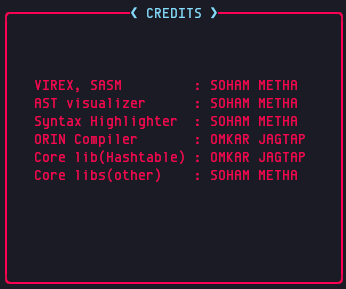

---
hide:
  - toc
---

## Maintainers

| Tool                    | Maintainer   |
| ----------------------- | ------------ |
| **VIREX, SASM**         | Soham Metha  |
| **AST visualizer**      | Soham Metha  |
| **Syntax Highlighter**  | Soham Metha  |
| **ORIN Compiler**       | Omkar Jagtap |
| **Core lib(Hashtable)** | Omkar Jagtap |
| **Core libs(other)**    | Soham Metha  |

!!! info inline end ""

    

## References

- [Tsoding](https://www.youtube.com/playlist?list=PLpM-Dvs8t0VY73ytTCQqgvgCWttV3m8LM)
- [Dr Birch](https://www.youtube.com/@dr-Jonas-Birch)
- [Low Byte Productions](https://www.youtube.com/playlist?list=PLP29wDx6QmW5DdwpdwHCRJsEubS5NrQ9b)
- [Cobb Coding](https://www.youtube.com/playlist?list=PLRnI_2_ZWhtCxHQ_3zDfW0-RgiWo8ftyj)

---
