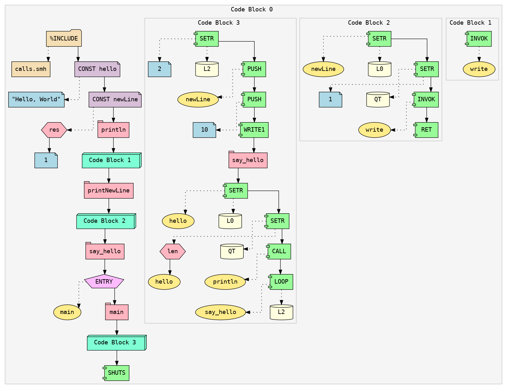

---
hide:
  - toc
---

=== "Syntax Highlighting"

    !!! info inline end ""

        <figure markdown="span">
          
          <figcaption>Click to enlarge</figcaption>
        </figure>

    

    To make coding in **SASM** more comfortable and developer-friendly,
    we’ve created a **custom VS Code theme** tailored specifically for
    the syntax of our language. This theme highlights key constructs,
    registers, operands, and labels, making it much easier to
    read and debug code at a glance.

    ✨ Install the theme by using our [install script](../Getting-Started#HIGHLIGHT-ON-LINUX).

    

=== "AST"

    !!! info inline end ""

        <figure markdown="span">
          
          <figcaption>Click to enlarge</figcaption>
        </figure>

    

    Understanding how your code is structured internally is crucial,
    That's why we built a visual AST (Abstract Syntax Tree) viewer,
    which displays the parsed structure of your program.

    This tool helps visualize how the assembler understands your code, showing
    the hierarchical structure of scopes, statement ordering within blocks, and
    how constants and expressions are resolved.

    !!! info "Local and Global Scopes"

        - Every code block in the visualized AST represents a **scope**.
        - **Block 0** is the *global scope*.

    This makes it significantly easier to debug parsing errors, optimize macros, and understand the flow of control — even for larger programs.

    

=== "GUI"

    !!! info inline end ""

        <figure markdown="span">
          
          <figcaption>Click to enlarge</figcaption>
        </figure>

    

    VIREX comes with a Command Line Interface (CLI) built using **NCurses**, providing a lightweight and responsive text-based UI.

    The interface is divided into several modular windows:

    - **Output Console** - Displays execution output and logs
    - **Memory Viewer** - Visualizes the virtual machine's RAM in real-time
    - **Instruction Trace** - Shows current and past executed instructions
    - **Register/Details Panel** - Displays register state and active flags

    The UI is currently being refactored to adopt a **plugin-based architecture**, allowing developers to hook into and customize rendering pipelines for each window.

    This system is designed to be minimal yet extensible, making it suitable for educational use, debugging, and experimentation.
    

!!! quote ""

## 🛠 Under Development

- 🔧 A new programming language called **ORIN** is currently under development. It is being designed to compile directly to SASM.

> If you're interested in compilers, language design, or virtual machines — **contributions are very welcome**!
