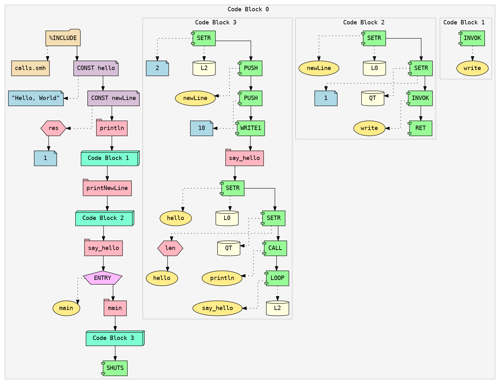
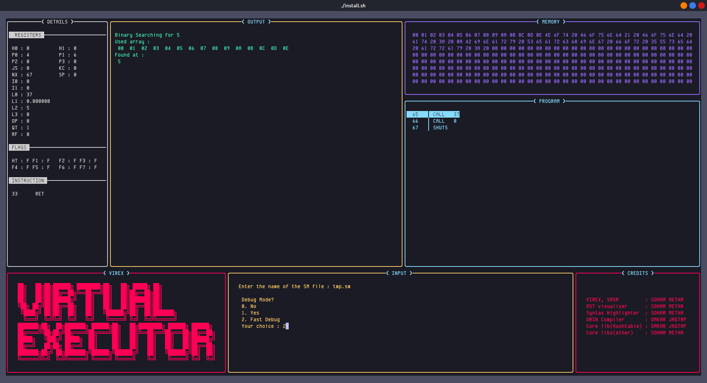
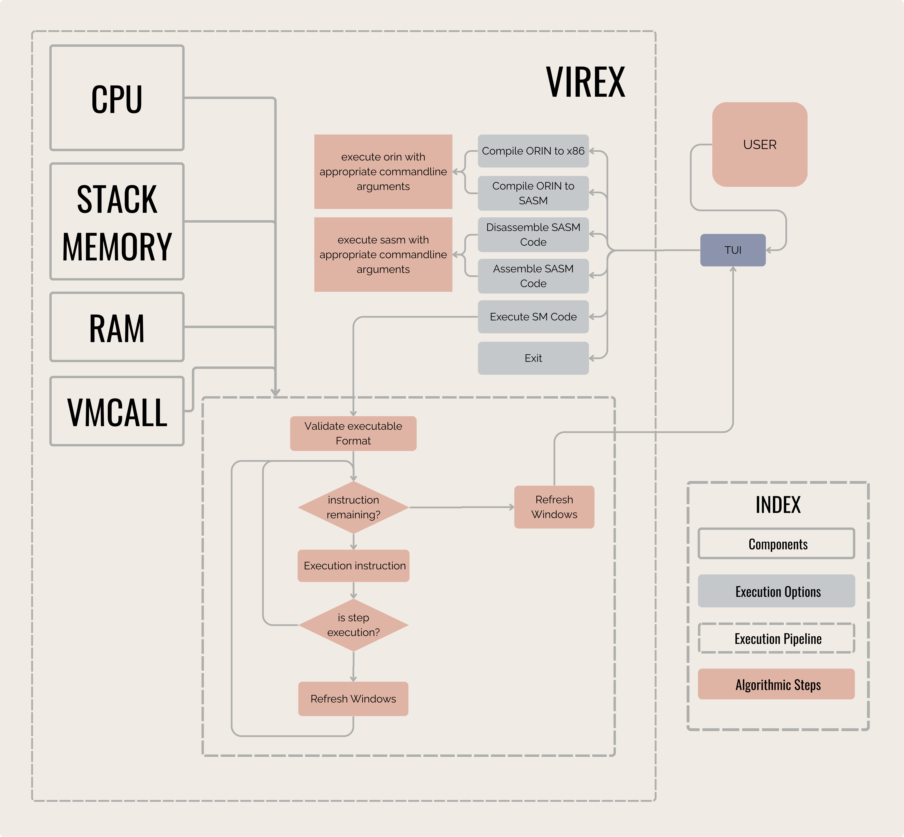

**VIREX** (VIRtual EXecuter) is a platform-independent virtual machine designed around a flexible intermediate language called **SASM** (Simulated Assembly). It’s inspired by the **Java Virtual Machine (JVM)**, but unlike JVM bytecode, SASM is **open, readable, and writable** — you can program directly in it.

## 🚀 What is SASM?

Just like Java compiles to bytecode for the JVM, any language can be compiled into SASM for VIREX. The difference is:

- SASM is **assembly-like**, human-readable, and editable.
- SASM is **open**, letting anyone build tools and languages around it.

You can even create your own programming language that compiles into SASM and runs anywhere VIREX runs — making your language instantly portable.

## 🧠 Why SASM?

- Learn how **assembly-level code** works through a clean and simplified syntax.
- Build a **compiler** without worrying about machine-level code generation.
- Make your own language **platform-independent** by targeting SASM.

## 🛠 Current Features

- ✅ **VS Code syntax highlighter** for SASM
- 🌲 **AST visualizer** for seeing how your SASM code is parsed and compiled
- 🔧 A new programming language called **ORIN** is currently under development. It is being designed to compile directly to SASM.

> If you're interested in compilers, language design, or virtual machines — **contributions are very welcome**!

---

## 📦 Project Structure

    /docs/      # Reference documentation
    /examples/  # Sample programs
    /include/   # Public headers for VM, SASM, OCC
    /src/       # Core implementation (VM, assembler, compiler)
    /tests/     # Simple Test programs written in SASM
    /tools/themes/vs_code/ # VS Code syntax highlighter
    /install.sh # Install script for linux

---

## 🧪 Getting Started (LINUX)

1. **Clone this repo:**
   ```bash
   git clone https://github.com/Soham-Metha/virex.git
   cd virex/
   ```
2. **Build the project (requires `sudo`):**
   ```bash
   ./install.sh
   ```
3. **Run an example program:**

   ```bash
   cd ./examples/SASM/
   virex
   ```

   > If the **TUI doesn't render properly**, try adjusting your **terminal font size**.

   > If that doesn't help, you can tweak layout values in **src/VM/vm_tui.c::CreateWindows()**.
   > The constants used are defined as **percentages** of the screen dimensions.

   > P.S. **kitty terminal** config, and font used, are available in `/tools`

4. **Inside VIREX, do the following:**

- Select **"Run SASM/ORIN command with custom flags"**
- Enter the following command:
  ```bash
  -i helloWorld.sasm -I ./ -o tmp.sm
  ```
  > ⌨️ use **Arrow keys** for navigation in menu.
- Select **"SASM build and exec"** by pressing **'a'**
- Enter the output filename (`tmp.sm`)

5. **Activate the syntax highlighter in VS Code**

- Open VS Code
- Press `Ctrl + Shift + P`
- Type: `Preferences: Color Theme`
- Select: `Palenight+sasm`
  > 🎨 Open any `.sasm` file in vs code to see the syntax highlighter at work!

---

## 💡 **Want to Contribute?**

**We’re actively building:**

1. The **ORIN programming language**
2. Improved **SASM tooling** (UI, debuggers, optimizers, etc.)
3. Expanded **[Documentation](https://virex.readthedocs.io/en/latest/)** and **tutorials**

!!! info inline end  ""

    📌 For contribution guidelines and a roadmap, see [CONTRIBUTING.md]() (coming soon).

---

## **Examples**

### **Syntax Highlighting:**

{ width="400" }

---

### **AST:**



!!! info "Local/Global Scopes"

    Each Code Block in the visualized AST represents a Scope, Block 0 being global scope.

---

### **Binary Executable:**


---

### **GUI:**



---

## **System Design and Architecture**



---


---

## Tech Stack

- **Programming Language:** C
- **Version Control:** Git
- **Build System:** GNU Make
- **AST VISUALIZER:** Graphviz

---

## Maintainers

| Tool                    | Maintainer   |
| ----------------------- | ------------ |
| **VIREX, SASM**         | Soham Metha  |
| **AST visualizer**      | Soham Metha  |
| **Syntax Highlighter**  | Soham Metha  |
| **ORIN Compiler**       | Omkar Jagtap |
| **Core lib(Hashtable)** | Omkar Jagtap |
| **Core libs(other)**    | Soham Metha  |

---

## References

- [Tsoding](https://www.youtube.com/playlist?list=PLpM-Dvs8t0VY73ytTCQqgvgCWttV3m8LM)
- [Dr Birch](https://www.youtube.com/@dr-Jonas-Birch)
- [Low Byte Productions](https://www.youtube.com/playlist?list=PLP29wDx6QmW5DdwpdwHCRJsEubS5NrQ9b)
- [Cobb Coding](https://www.youtube.com/playlist?list=PLRnI_2_ZWhtCxHQ_3zDfW0-RgiWo8ftyj)

---
